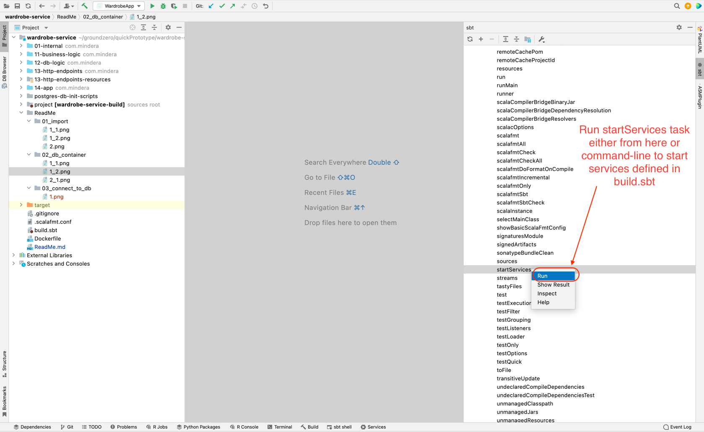

<details><summary>1. Import project in intellij</summary>

<ins>**You can choose one of the below ways to open project in intellij :-**</ins>

<p align="center"><ins>When there is no project open in intellij</ins></p>


**Repo Url :-**   
https://github.com/jerrytheprogrammer/wardrobe-service.git


<p align="center"><ins>When there is already a project open in intellij</ins></p>


</details>

<br/>

<details><summary>2. Start postgres database with wardrobe-service database and tables (Docker required)</summary>


To start database as docker container, **startServices** task should be invoked   
from command-line or from intellij.
<br/><br/>
**startServices** task is implemented in **fluent-style-sbt plugin**.
<br/><br/>
Any docker service that is defined in `build.sbt` or in scala file inside project directory   
can be started using **startServices**. 

`project/ServiceDependencies.scala` can be referred for example :-   


```
DockerContainer("postgres", "latest", Option("clothes-db"))
      .withEnv(s"POSTGRES_PASSWORD=${postgresDbConf("CLOTHING_DB_PASSWORD")}")
      .withPorts(5432 -> postgresDbConf("CLOTHING_DB_PORT").toInt)
      .withNetworkMode( DockerNetwork("aws-net") )
      .withVolumes( Seq(
        VolumeMapping(postgresDbInitScriptsDirectory, "/docker-entrypoint-initdb.d/")
      ) )
      .withReadyChecker(
        DockerReadyChecker.LogLineContains(
          "PostgreSQL init process complete"
        )
      )
```

**Note :- To initialize wardrobe-service database, scripts inside `postgres-db-init-scripts` will be loaded on postgres db container startup**   

<ins>**You can choose one of the below ways to start postgres db :-**</ins>

<p align="center"><ins>From intellij</ins></p>




<p align="center"><ins>From command-line</ins></p>


</details>

<br/>

<details><summary>3. Connect to database</summary>

Once database docker container starts successfully,   
below command can be used to connect :-    

`docker exec -it clothes-db psql -U postgres`


</details>

<br/>

<details><summary>4. Start application</summary>

<ins>**You can choose one of the below ways to start application :-**</ins>

<p align="center"><ins>From intellij</ins></p>

**WardrobeApp** configuration should be visible on loading project in intellij.     
Run WardrobeApp configuration to start service.   


<br/><br/>

<p align="center"><ins>From command-line</ins></p>

Execute below command **inside wardrobe-service directory** to create shell-script launch file for our wardrobe-service app in `target/pack/bin` directory :-   
`sbt clean compile pack`

Now, execute `sh target/pack/bin/wardrobe-service` to start service     
<br/><br/>

<p align="center"><ins>As docker image</ins></p>

Execute below command **inside wardrobe-service directory** to create docker image of our app :-   
`sbt clean compile pack buildImage`

On executing `docker images`, following images will be listed :- 
```
docker images
REPOSITORY                 TAG       IMAGE ID       CREATED         SIZE
mindera/wardrobe-service   0.0.1     db8495b66c42   9 minutes ago   210MB
mindera/wardrobe-service   latest    db8495b66c42   9 minutes ago   210MB
postgres                   latest    74b0c105737a   2 weeks ago     376MB
```

Also, on executing `docker ps -a`, following containers will be listed :-   
```
docker ps -a
CONTAINER ID   IMAGE             COMMAND                  CREATED          STATUS          PORTS                    NAMES
3c95b4cba782   postgres:latest   "docker-entrypoint.s…"   11 seconds ago   Up 11 seconds   0.0.0.0:5432->5432/tcp   clothes-db
```

Now, `clothes-db` container is started in **section2** of this **ReadMe** and container is running on **aws-net** network.   
So, we will start **wardrobe-service** as docker container using below command :-   

```
docker network create aws-net
docker run --rm --name wardrobe-service -e POSTGRES_PASSWORD=doNotUseThis -e POSTGRES_HOST=clothes-db -d -p 8080:8080 --network=aws-net mindera/wardrobe-service:0.0.1
```

Now, on executing `docker ps -a`, following containers will be listed :-
```s
docker ps -a
CONTAINER ID   IMAGE                            COMMAND                  CREATED         STATUS         PORTS                    NAMES
a7078177fe8d   mindera/wardrobe-service:0.0.1   "sh app/bin/wardrobe…"   3 seconds ago   Up 2 seconds   0.0.0.0:8080->8080/tcp   wardrobe-service
3c95b4cba782   postgres:latest                  "docker-entrypoint.s…"   5 minutes ago   Up 4 minutes   0.0.0.0:5432->5432/tcp   clothes-db
```
</details>

<br/>

<details><summary>5. Sample Requests</summary>

<ins>Get Requests :-</ins>

curl http://localhost:8080/v1/clothes/name/walk

curl http://localhost:8080/v1/clothes/name/walk

<ins>Post Requests :-</ins>

curl -d '{"name" : "Nice Blue Cap", "category" : "Caps"}' -H 'Content-Type: application/json' http://localhost:8080/v1/add

</details>